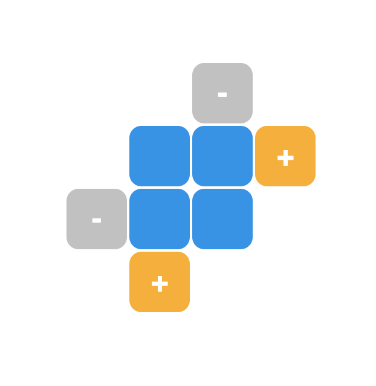

Follow [this instruction](https://github.com/mate-academy/layout_task-guideline/blob/master/README.md) to solve task

### Task: Growth table

Let's blow up this table!

Your task sounds simple: Do you see yellow buttons? Give the table the opportunity to grow in different directions.

Preview:

Some rules:
- Click on the button with class `append-row` should append a new row to the table.
- Click on the button with class `remove-row` should remove the last row from the table.
- Click on the button with class `append-column` should append a new column to the table.
- Click on the button with class `remove-column` should remove the last column from the table.
- The max count of rows or columns is 10.
- The min count of rows or columns is 2.
- If the count of columns or rows reaches maximum or minimum, set disabled the corresponding button.

As always, on JS Advanced course you do not need to change the HTML layout or CSS styles.

Examples:

